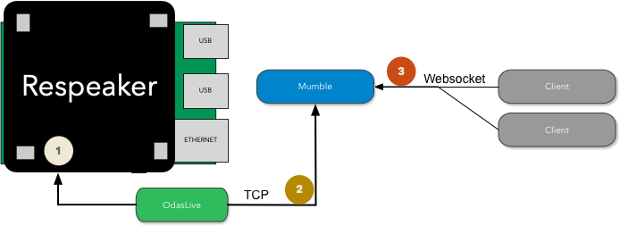

# Mumble

Mumble is an app created for the noise dashboard project described in this [medium article](https://medium.com/homeday/building-a-noise-level-dashboard-for-your-office-with-a-raspberry-pi-71360ee1ff46?sk=652de93b0eaf5361133f5638970cfde7).



The setup is basically this:

- Raspberry PI 3 with the [Respeaker board](http://wiki.seeedstudio.com/ReSpeaker_4_Mic_Array_for_Raspberry_Pi/) provides microphone
- [Odas](https://github.com/introlab/odas), in particular, *odaslive* runs on the PI and does great things such as detecting sources and potential energy levels **(1)**
- Odaslive sends its data in JSON to the TCP server that mumble provides **(2)**
- Clients willing to receive JSON data connect to mumble via websockets **(3)**
- Mumble echoes the JSON data to the clients
- Win & profit :)

## Prerequisites

- Raspberry PI
  - respeaker software
  - [odaslive](https://github.com/introlab/odas)
  - [pm2](https://pm2.keymetrics.io/docs/usage/quick-start/) startup (`systemctl enable pm2-pi`)

## Running the odaslive binary

Pm2 takes care of this, check `ecosystem.config.js` and update the app configuration if necessary:

```
 {
      name: 'odaslive',
      // you may want to adjust the path to your odas installation
      script: '~/odas/bin/odaslive -c ~/odas/config/odaslive/respeaker_4_mic_array.cfg',
      args: '',
      instances: 1,
      autorestart: true,
      watch: true,
      max_memory_restart: '512M',
    }
```

## Deployment

The current `ecosystem.config.js` deploys this repo via SSH to a host named `noise-pi`. Feel free to update the configuration locally as necessary.

To deploy, run `pm2 deploy production update`


## Contributing

PRs are welcome! :)
